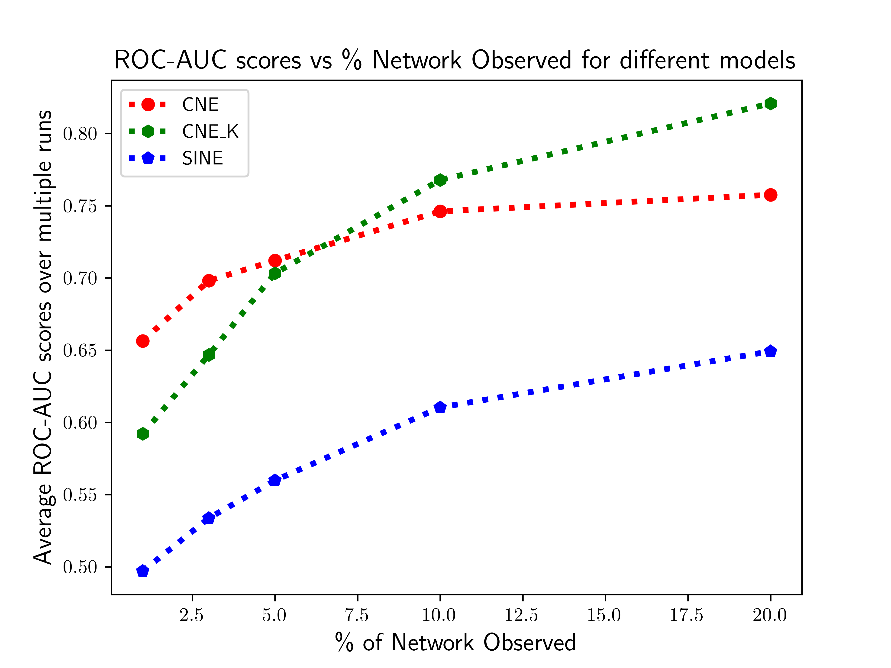
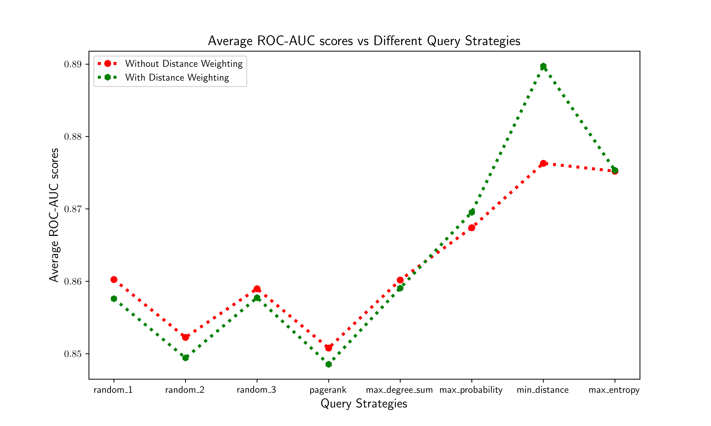

# Active Learning using Node Embeddings in Partially Observed Networks. 

Work done as a part of **CS768 - Learning With Graphs [Autumn' 21]**.

Find the report [**here**](report.pdf).

### Team Information:

| Name                | Contact                    |
| -----------         | -----------                |
| Richeek Das         | richeek@cse.iitb.ac.in     |
| Saumya Goyal        | saumyagoyal@cse.iitb.ac.in |
| Tirthankar Adhikari | 190070003@iitb.ac.in       |

### Requirements [Tested On]:
* numpy 1.20.0
* scipy 1.7.1
* pandas 1.3.2
* matplotlib 3.4.3
* Conditional Network Embedding (modified from https://bitbucket.org/ghentdatascience/cne)

### Datasets
* The Harry Potter **network**: https://github.com/efekarakus/potter-network
* Polbooks: http://www-personal.umich.edu/~mejn/netdata/
* C.elegans: http://www-personal.umich.edu/~mejn/netdata/
* USAir http://vlado.fmf.uni-lj.si/pub/networks/data/
* MP_cc: We collect the data in April 2019 for the Members of Parliament in the UK. It originally has 650 nodes and we only use the largest connected component of 567 nodes and 49631 friendships.
* Polblogs_cc: http://www-personal.umich.edu/~mejn/netdata/ We use its largest connected component.
* PPI_cc: https://snap.stanford.edu/node2vec/ We use its largest connected component.
* Blog: https://snap.stanford.edu/node2vec/

### Experiments

**Experiment 1:** Comparison of the **average ROC-AUC** scores achieved by **CNE, CNE_K** and **SINE** as the Node Embedding models in **ALPINE** with respect to the change in **% of network observed**.
   

   To run this experiment: `python3 exp1.py`
   To plot: `python3 plt_exp1.py`

**Experiment 2:** Comparison of the **average ROC-AUC** scores achieved by **CNE_K** as the Node Embedding model with respect to the different querying strategies implemented, with and without the Information Density weighting addition.
   

   To run this experiment: `python3 exp2.py`
   To plot: `python3 plt_exp2.py`

### Run
1. Select and load a dataset in run.py.
2. Choose Case (i.e., 1, 2, 3), set the values of r_0 (the initially observed portion of node pairs), nr_split and nr_ne (the averaging parameters that can be set small in order to save time).
3. 'python run.py'

*Note that for large networks, e.g., dataset blog, it takes large memory and a few hours to iterate 5 times. More specifically, to run experiments on blog network, parallel computation for all the strategies might cause memory error if the device memory is not enough. But you can still run it sequentially. An example for the run time - blog with r_0 being 10% for Case-2 would take approximately 4 hours. It is also possible to define your own PON, as well as the pool and the target set.*

### Results
The results are visualized in the 'folder' defined for the this experiment named 'results.png'. See line 129~145 in run.py: the folder with results for different cases start with:

* Case-1 - 'TU_PU_r0...'
* Case-2 - 'TU_r0...'
* Case-3 - 'r0_...'

### Forked from [parent](https://github.com/aida-ugent/alpine_public) repository